# README 산출 문서 검토 부탁드리고, 수정 필요 시 수정 부탁드립니다. (박건희)

## 추가 확인 필요

* 정확한 프로젝트 기간
* 배포 URL
* GitHub 저장소 URL
* 팀원별 최종 담당 범위와 커밋 기준 기여 내용
* 최종 시연 영상 링크

# 📎 약속 : 藥束 (팀명: Jetson5)

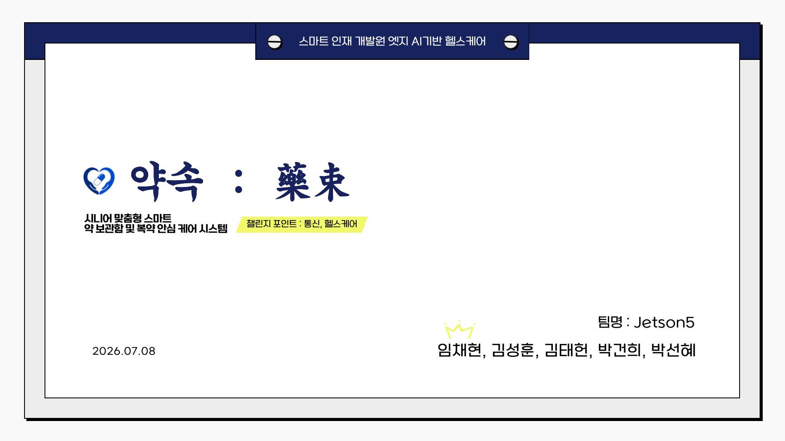

 

## 👀 서비스 소개

* **서비스명:** 약속 : 藥束
* **서비스 한 줄 소개:** 시니어 맞춤형 스마트 약 보관함 및 복약 안심 케어 시스템
* **서비스 설명:**  
  정기적인 복약이 필요한 고령층을 대상으로, 라즈베리파이 기반 스마트 약통과 웹 대시보드를 연동하여 복약 시간 알림, 약통 개폐 감지, 무게 변화 기반 복약 여부 판단, 복약 기록 조회, 미복약 알림 관리를 제공하는 서비스입니다. 보호자는 웹 화면에서 보호대상자의 복약 스케줄과 복약 상태를 확인할 수 있고, 관리자는 회원 및 약상자 상태를 관리할 수 있습니다.

> 확인된 내용: PPT 기준 서비스명, 팀명, 주요 기능, ERD, 하드웨어 구성, 화면 구성, 팀원 역할은 확인 가능합니다.  
> 보완 필요: 정확한 프로젝트 시작일, 배포 URL, 최종 GitHub 주소는 별도 확인 후 입력하면 좋습니다.

 

## 📅 프로젝트 기간

* **2026.??.?? ~ 2026.07.08**
* 발표일 기준: **2026.07.08**
* 정확한 시작일은 확인 후 수정 필요

 

## ⭐ 주요 기능

* **회원가입 및 로그인**  
  보호자/관리자 사용자가 계정을 생성하고 로그인하여 서비스 기능을 이용할 수 있습니다.

* **보호대상 및 보호자 등록**  
  보호자는 관리할 시니어를 등록하고, 필요 시 보호자 정보를 추가로 관리할 수 있습니다.

* **약통 구매 및 약통 등록**  
  서비스 화면에서 스마트 약상자를 구매하거나, 보유한 약통 시리얼 번호를 입력하여 보호대상자와 연결할 수 있습니다.

* **복약 스케줄 등록**  
  아침, 점심, 저녁, 취침 전으로 복약 구분을 나누고, 각 시간대마다 약통 칸 번호와 복약 예정 시간을 등록할 수 있습니다.

* **센서 기반 복약 행동 감지**  
  마이크로 스위치, 리드 스위치, 로드셀 무게 센서를 활용하여 약통 문 개폐와 알약 무게 변화를 감지합니다.

* **복약 기록 및 알림 관리**  
  복약 완료, 미복약, 예정 상태를 기록하고 보호자가 웹에서 복약 현황과 알림 내역을 조회할 수 있습니다.

* **관리자 대시보드**  
  관리자 화면에서 회원, 약상자, 문의/답변 등의 운영 정보를 확인하고 관리할 수 있습니다.

 

## ⛏ 기술스택

<table>
    <tr>
        <th>구분</th>
        <th>내용</th>
    </tr>
    <tr>
        <td>사용언어</td>
        <td>
            
            
            
            
        </td>
    </tr>
    <tr>
        <td>Backend</td>
        <td>
            
            
            
        </td>
    </tr>
    <tr>
        <td>Database</td>
        <td>
            
        </td>
    </tr>
    <tr>
        <td>IoT / Hardware</td>
        <td>
            
            
            
            
            
            
            
        </td>
    </tr>
    <tr>
        <td>개발도구</td>
        <td>
            
            
            
        </td>
    </tr>
</table>

 

## ⚙ 시스템 아키텍처
!시스템 아키텍처()

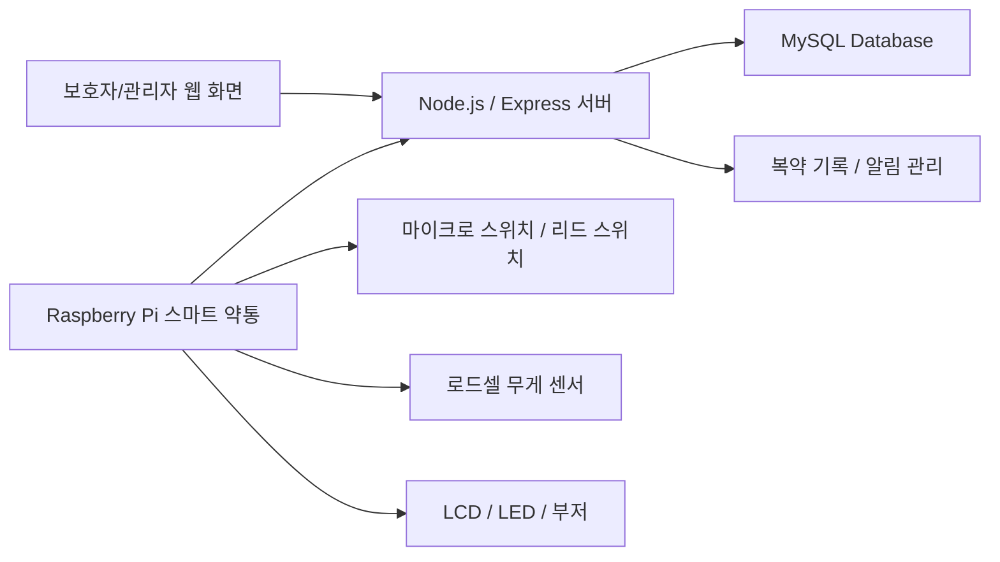
```mermaid
flowchart LR
    A[보호자/관리자 웹 화면] --> B[Node.js / Express 서버]
    B --> C[MySQL Database]
    D[Raspberry Pi 스마트 약통] --> B
    D --> E[마이크로 스위치 / 리드 스위치]
    D --> F[로드셀 무게 센서]
    D --> G[LCD / LED / 부저]
    B --> H[복약 기록 / 알림 관리]
```

 

## 📌 프로젝트 개요 및 차별성

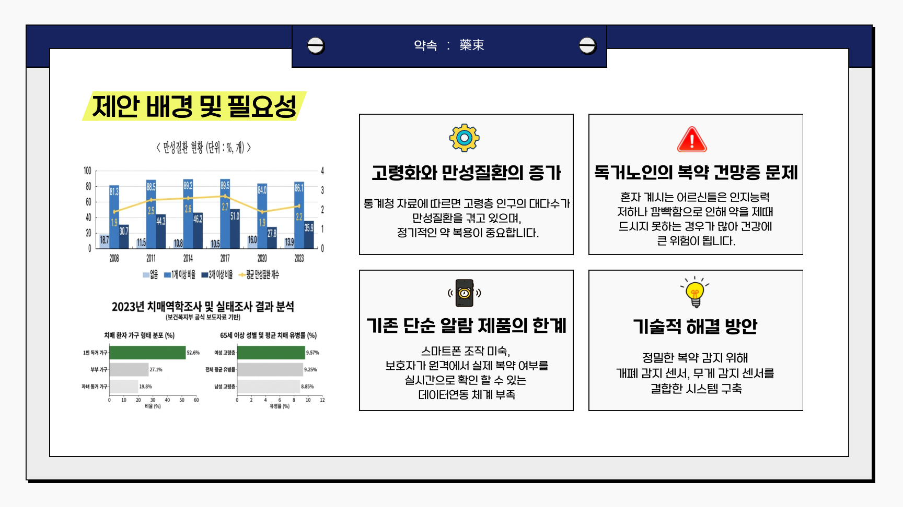

### 제안 배경

* 고령화와 만성질환 증가로 인해 정기적인 약 복용 관리의 중요성이 커지고 있습니다.
* 독거노인의 경우 인지능력 저하나 깜빡함으로 인해 약을 제때 복용하지 못할 위험이 있습니다.
* 기존 단순 알림 제품은 알람을 울릴 수는 있지만, 사용자가 실제로 약을 꺼냈는지 보호자가 실시간으로 확인하기 어렵습니다.

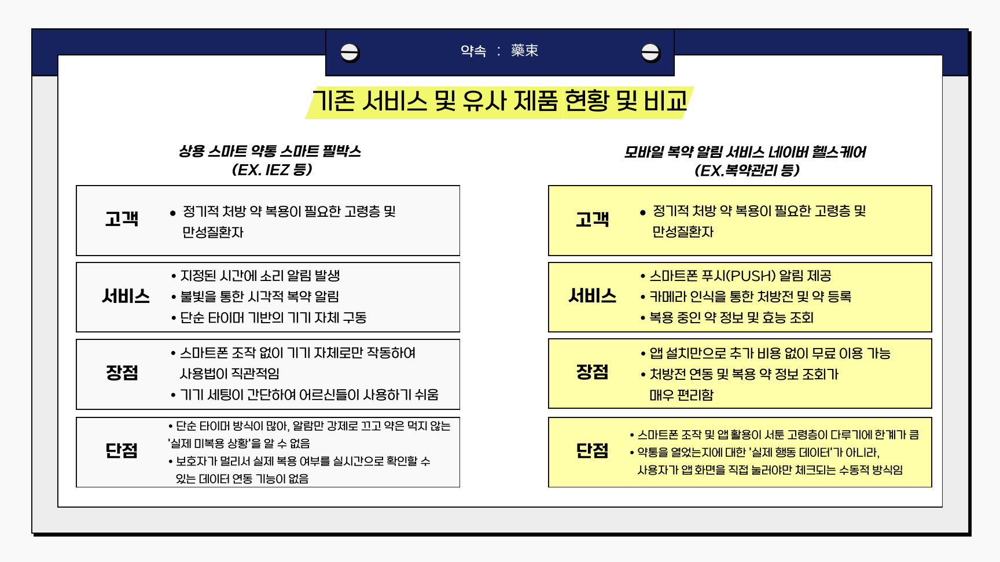

### 차별성

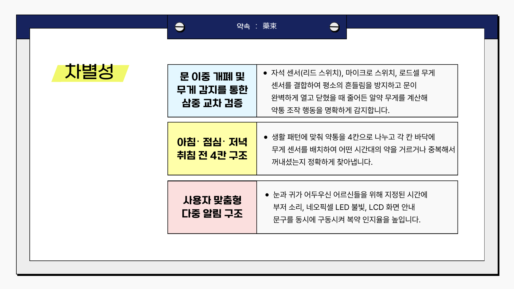

* **문 이중 개폐 감지 + 무게 감지 기반 삼중 교차 검증**
  * 마이크로 스위치로 전체 문 개폐를 감지합니다.
  * 리드 스위치로 해당 스케줄 칸의 문 개폐를 감지합니다.
  * 로드셀 무게 센서로 알약 무게 변화를 확인합니다.

* **아침·점심·저녁·취침 전 4칸 구조**
  * 생활 패턴에 맞춰 약통을 4칸으로 나누고, 각 시간대의 복약 스케줄과 약통 칸을 연결합니다.

* **사용자 맞춤형 다중 알림 구조**
  * 복약 예정 시간에 LCD 안내, LED, 부저 등을 함께 활용하여 고령층의 복약 인지율을 높입니다.

 

## 🎯 개발 목표

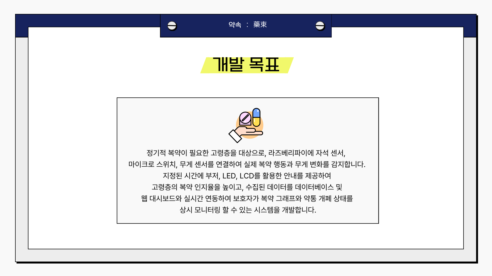

정기적 복약이 필요한 고령층을 대상으로, 라즈베리파이에 자석 센서, 마이크로 스위치, 무게 센서를 연결하여 실제 복약 행동과 무게 변화를 감지합니다. 지정된 시간에 부저, LED, LCD를 활용한 안내를 제공하고, 수집된 데이터를 데이터베이스 및 웹 대시보드와 실시간 연동하여 보호자가 복약 그래프와 약통 개폐 상태를 상시 모니터링할 수 있는 시스템을 개발하는 것을 목표로 합니다.

 

## 📌 ER 다이어그램

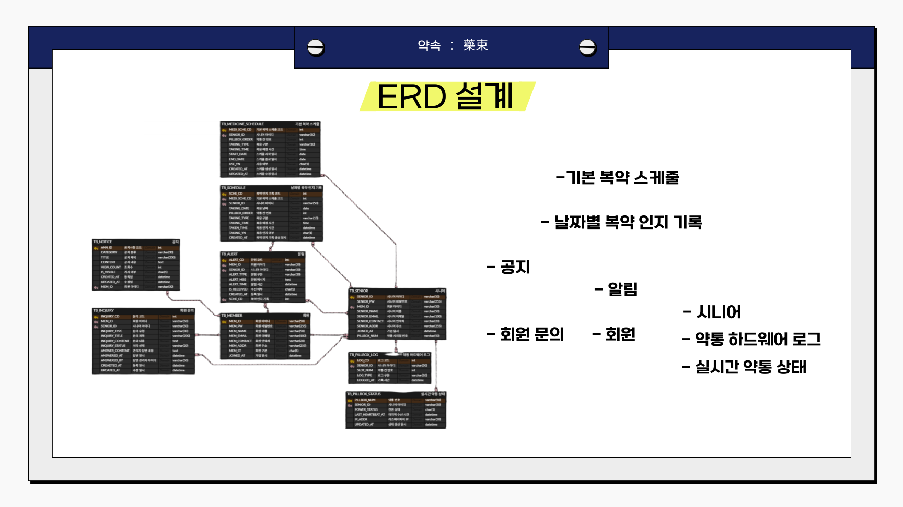

### 주요 테이블 구성

* **TB_MEMBER**: 회원/보호자/관리자 정보
* **TB_SENIOR**: 보호대상자 정보 및 약통 번호 연결
* **TB_MEDICINE_SCHEDULE**: 기본 복약 스케줄
* **TB_SCHEDULE**: 날짜별 복약 인지 기록
* **TB_PILLBOX_LOG**: 약통 하드웨어 로그
* **TB_PILLBOX_STATUS**: 실시간 약통 상태
* **TB_ALERT**: 알림 발송 및 수신 여부 기록
* **TB_INQUIRY**: 회원 문의 및 관리자 답변
* **TB_NOTICE**: 공지사항

### DB 설계 의도

* 기본 스케줄과 날짜별 복약 기록을 분리하여, 스케줄 수정 이후에도 과거 복약 이력은 보존할 수 있도록 설계했습니다.
* 약통 로그 테이블을 별도로 두어 센서 이벤트를 원본 로그 형태로 저장하고, 복약 기록 테이블과 구분했습니다.
* 알림 테이블은 복약 기록과 연결하여 미복약 알림의 중복 발송을 방지할 수 있도록 관리합니다.

 

## 🧩 하드웨어 설계

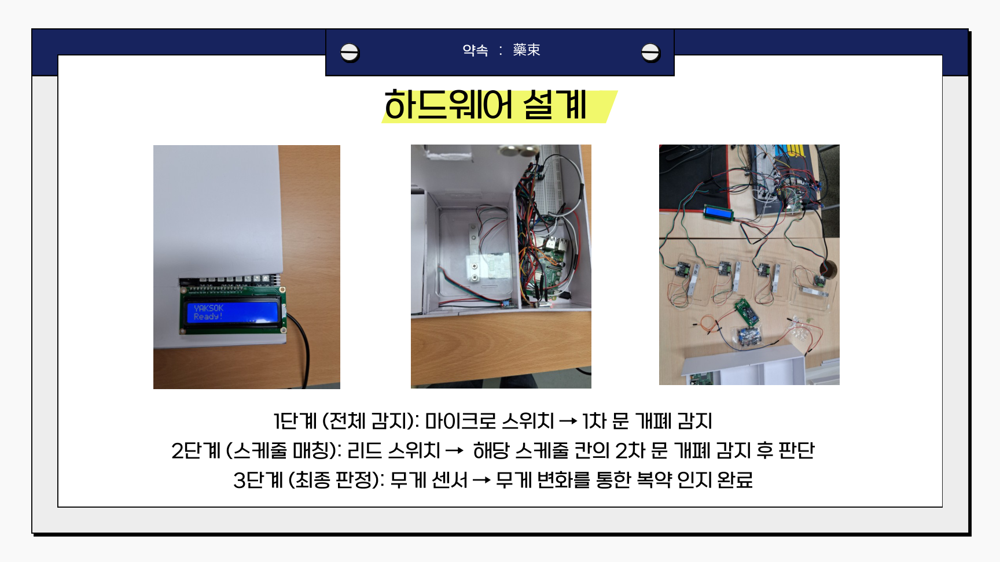

### 복약 판단 흐름

1. **전체 문 개폐 감지**  
   마이크로 스위치로 약통 전체 문이 열렸는지 1차 감지합니다.

2. **스케줄 칸 매칭**  
   리드 스위치로 해당 복약 시간대의 칸이 열렸는지 확인합니다.

3. **무게 변화 확인**  
   로드셀 무게 센서로 알약이 실제로 줄었는지 확인하여 복약 여부를 최종 판단합니다.

 

## 🖥 화면 구성

### 회원가입 및 로그인

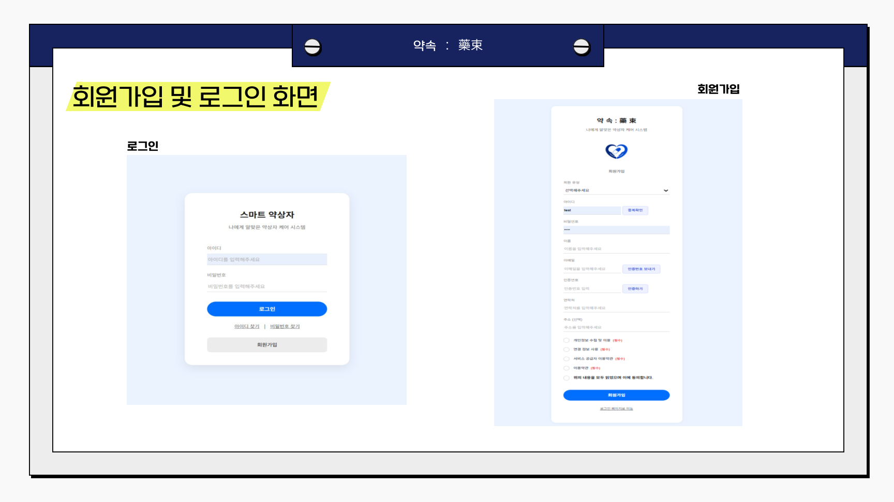

* 사용자는 아이디와 비밀번호로 로그인할 수 있습니다.
* 회원가입 시 아이디 중복 확인, 이메일 인증, 연락처 인증 등 사용자 정보를 입력합니다.

 

### 시작 화면

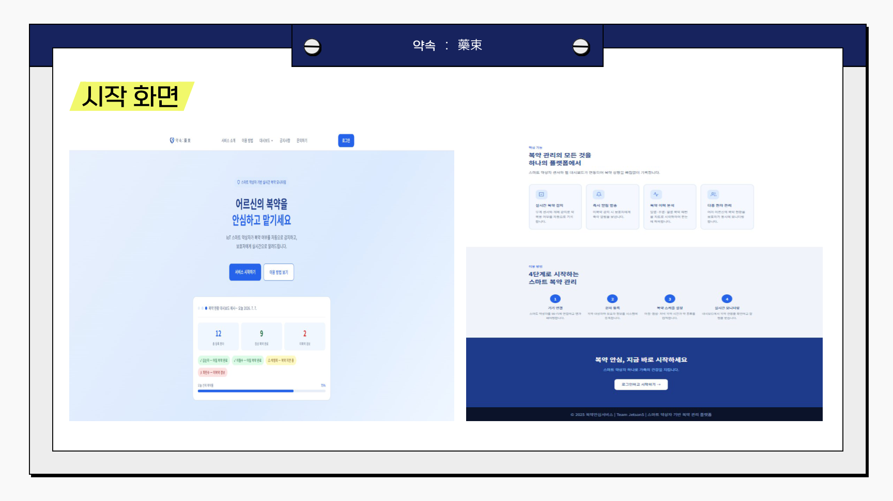

* 서비스 소개, 주요 기능, 스마트 복약 관리 단계 등을 안내합니다.
* 로그인 또는 서비스 시작하기 버튼을 통해 주요 기능으로 이동할 수 있습니다.

 

### 약통 구매

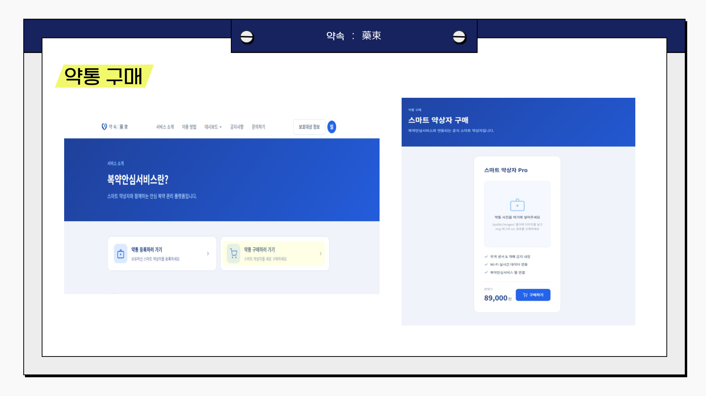

* 스마트 약상자 구매 화면을 제공합니다.
* 제품 설명, 가격, 구매 버튼 등을 통해 약통 구매 흐름을 구성했습니다.

 

### 약통 등록

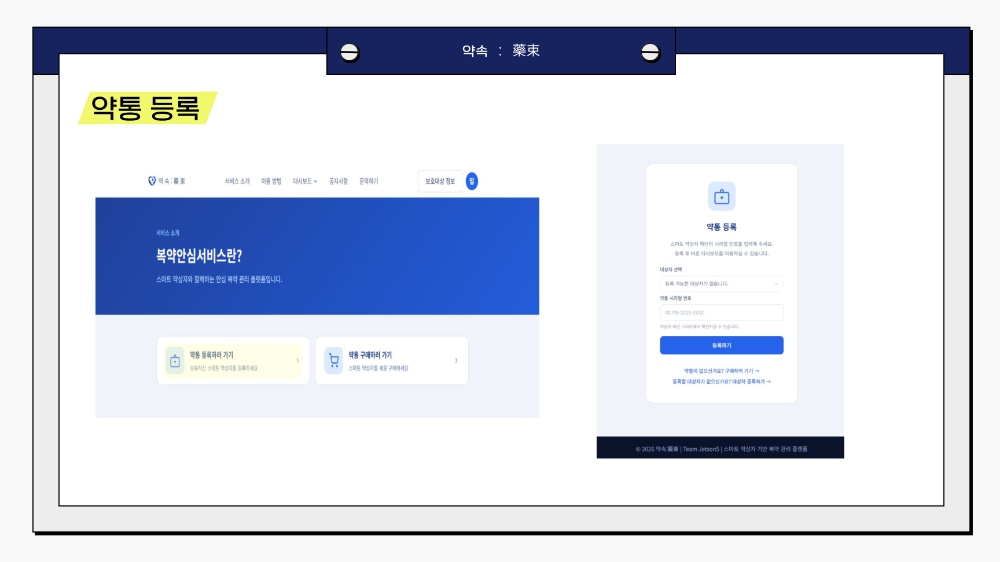

* 보호대상자를 선택하고 약통 시리얼 번호를 입력하여 약통을 등록합니다.
* 등록된 약통은 이후 복약 스케줄과 센서 로그 연동에 사용됩니다.

 

### 보호대상 및 보호자 등록

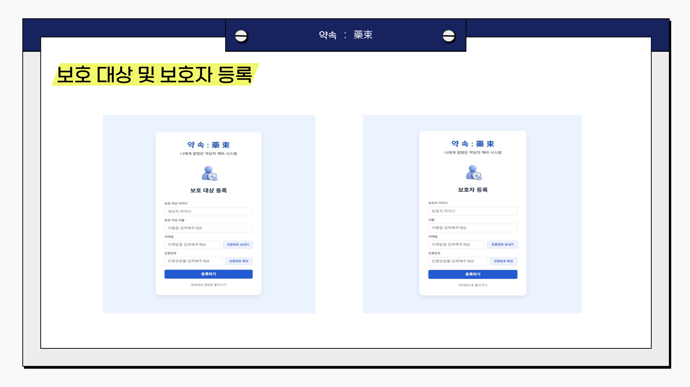

* 보호대상자 등록 화면과 보호자 등록 화면을 분리했습니다.
* 보호대상자 정보와 보호자 정보를 입력하여 복약 관리 관계를 구성합니다.

 

### 스케줄 등록

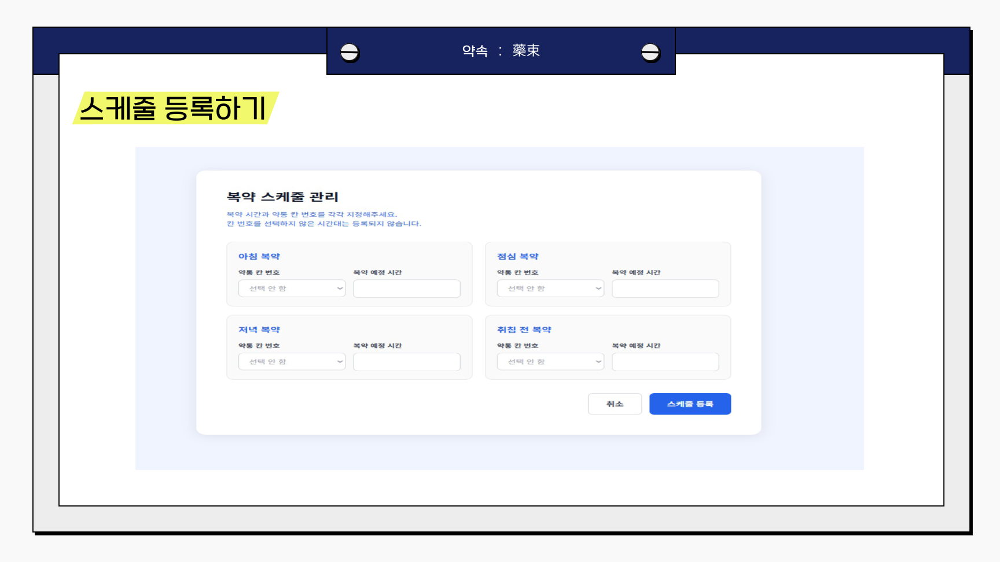

* 아침, 점심, 저녁, 취침 전 복약 스케줄을 등록할 수 있습니다.
* 각 시간대마다 약통 칸 번호와 복약 예정 시간을 입력합니다.

 

### 복약 기록 및 알림 관리

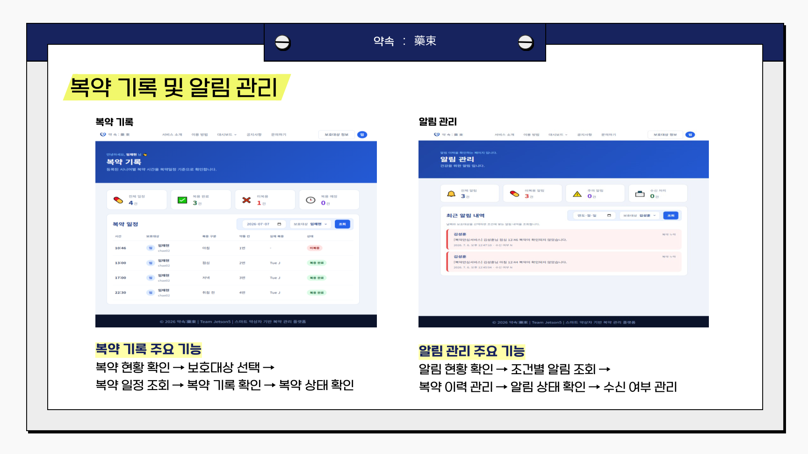

* 복약 기록 화면에서는 보호대상자별 복약 일정, 복약 완료, 미복약, 복약 예정 상태를 확인할 수 있습니다.
* 알림 관리 화면에서는 미복약 알림 내역, 처리 상태, 수신 여부를 관리할 수 있습니다.

 

### 관리자 대시보드

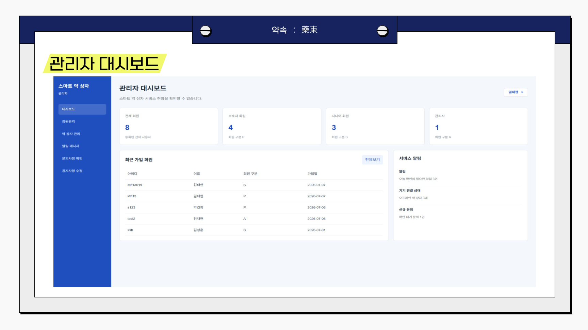

* 전체 회원 수, 보호대상자 수, 등록된 약통 수, 문의 현황 등을 확인합니다.
* 관리자 관점에서 서비스 운영 상태를 한눈에 파악할 수 있습니다.

 

### 회원 관리 및 약상자 관리

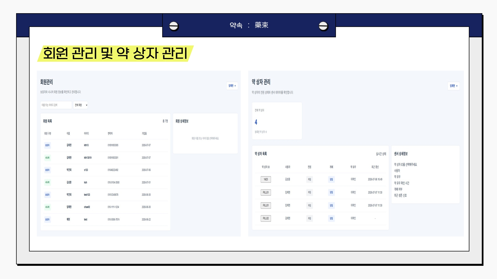

* 회원 목록, 회원 상태, 약상자 등록 상태 등을 관리합니다.
* 약상자별 상태와 연결 정보를 확인할 수 있습니다.

 

## 🎬 시연 영상

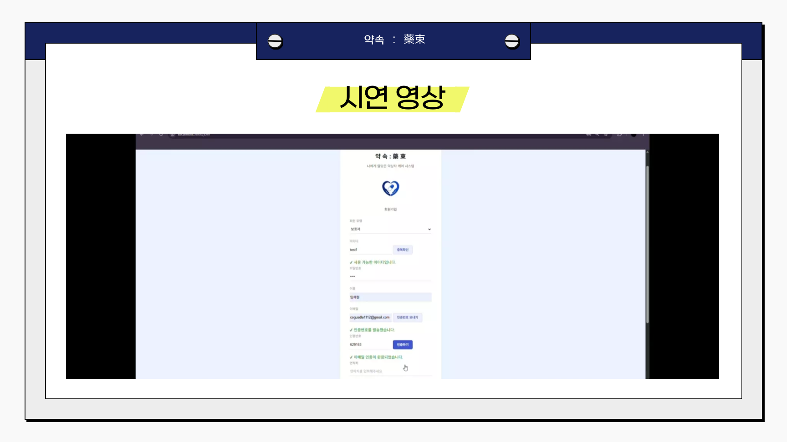

* 회원가입 및 로그인
* 보호대상 등록
* 약통 등록
* 복약 스케줄 등록
* 약통 개폐 및 무게 변화 감지
* 복약 기록 및 미복약 알림 확인

 

## ✅ 기대 효과

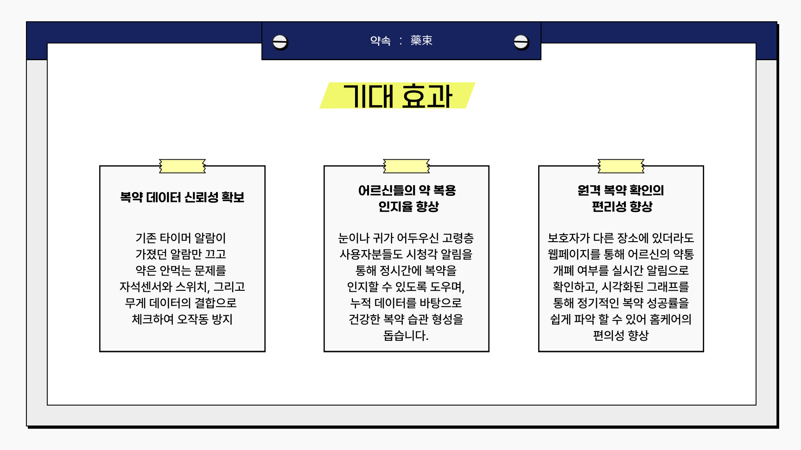

* **복약 데이터 신뢰성 확보**  
  단순 알림이 아니라 문 개폐와 무게 변화를 함께 확인하여 실제 복약 행동에 가까운 데이터를 수집합니다.

* **어르신 복약률 향상**  
  부저, LED, LCD 안내를 통해 시청각 알림을 제공하여 복약 인지를 돕습니다.

* **원격 복약 확인의 편의성 향상**  
  보호자가 웹 대시보드에서 보호대상자의 복약 상태를 확인할 수 있습니다.

 

## 📌 활용 방안

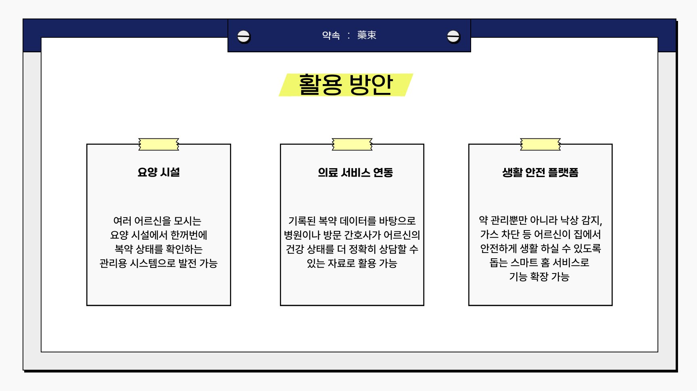

* **요양 시설**  
  다수의 어르신 복약 상태를 체계적으로 관리하는 데 활용할 수 있습니다.

* **의료 서비스 연동**  
  복약 이력 데이터를 기반으로 의료진 또는 보호자에게 복약 상태를 공유할 수 있습니다.

* **생활 안전 플랫폼 확장**  
  복약 관리뿐 아니라 고령층 생활 안전 모니터링 서비스로 확장할 수 있습니다.

 

## 👨‍👩‍👦‍👦 팀원 역할

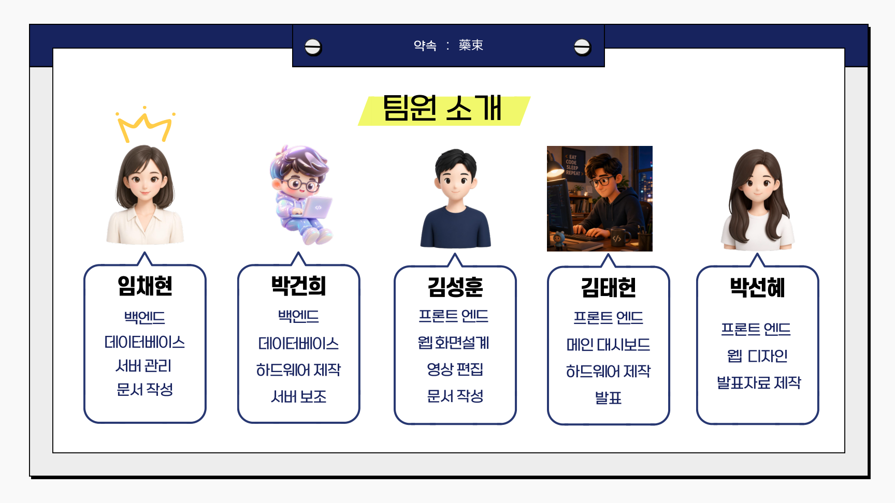

<table>
  <tr>
    <th>이름</th>
    <th>역할</th>
    <th>담당 내용</th>
  </tr>
  <tr>
    <td align="center"><strong>임채현</strong></td>
    <td align="center"><b>백엔드</b></td>
    <td>서비스 데이터 구조 설계, DB 연동, 프로젝트 문서 정리</td>
  </tr>
  <tr>
    <td align="center"><strong>박건희</strong></td>
    <td align="center"><b>백엔드</b></td>
    <td>DB 설계 및 데이터 관리, API/데이터 처리 지원</td>
  </tr>
  <tr>
    <td align="center"><strong>김성훈</strong></td>
    <td align="center"><b>프론트엔드</b></td>
    <td>웹 화면 구현, UI 구성, 대시보드 화면 개발</td>
  </tr>
  <tr>
    <td align="center"><strong>김태현</strong></td>
    <td align="center"><b>프론트엔드</b></td>
    <td>화면 구현, 서비스 페이지 구성, 발표 자료 제작</td>
  </tr>
  <tr>
    <td align="center"><strong>박선혜</strong></td>
    <td align="center"><b>프론트엔드</b></td>
    <td>웹 디자인, 화면 구성, 발표 자료 제작</td>
  </tr>
</table>

> 팀원별 세부 역할은 PPT에 표기된 역할을 기준으로 정리했습니다. 실제 GitHub 담당 커밋 내역에 따라 담당 내용을 더 구체화하면 좋습니다.

 

## 🤾‍♂️ 트러블슈팅

프로젝트 진행 중 발생한 문제 중 포트폴리오에 넣기 좋은 이슈를 중심으로 정리했습니다. 단순 오타나 경로 실수보다는, 센서-서버-DB 연동 과정에서 원인을 추적하고 구조를 개선한 내용 위주입니다.

### 1. 복약 여부를 단순 문 열림만으로 판단하기 어려운 문제

* **문제 상황**  
  약통 문이 열렸다는 사실만으로는 사용자가 실제로 약을 꺼냈는지 확인하기 어려웠습니다. 문을 열었다 닫기만 해도 복약으로 처리될 가능성이 있었습니다.

* **원인 분석**  
  단일 센서 이벤트만 사용하면 실제 복약 행동과 단순 조작 행동을 구분하기 어렵습니다.

* **해결 방향**  
  마이크로 스위치, 리드 스위치, 로드셀 무게 센서를 함께 사용하여 문 개폐와 무게 감소를 교차 검증하는 구조로 설계했습니다.

* **결과**  
  약통 문 개폐 이벤트와 실제 알약 무게 변화를 함께 확인하여 복약 판단의 신뢰도를 높였습니다.

 

### 2. 기본 복약 스케줄과 날짜별 복약 기록을 한 테이블에 저장할 경우 이력 관리가 어려운 문제

* **문제 상황**  
  사용자가 복약 시간을 수정했을 때, 과거 복약 기록까지 함께 변경된 것처럼 보일 위험이 있었습니다.

* **원인 분석**  
  반복되는 기본 스케줄과 하루 단위의 실제 복약 결과는 성격이 다릅니다. 이를 하나의 테이블에서 관리하면 과거 이력 보존과 미래 일정 수정이 충돌할 수 있습니다.

* **해결 방향**  
  기본 스케줄은 `TB_MEDICINE_SCHEDULE`, 날짜별 복약 결과는 `TB_SCHEDULE`로 분리했습니다.

* **결과**  
  스케줄 수정은 이후 일정에 반영하고, 이미 발생한 복약 기록은 별도 이력으로 보존할 수 있는 구조를 만들었습니다.

 

### 3. 미복약 알림이 중복 발송될 수 있는 문제

* **문제 상황**  
  스케줄러가 일정 주기로 미복약 대상을 조회할 때, 같은 복약 건에 대해 알림이 반복 저장되거나 발송될 가능성이 있었습니다.

* **원인 분석**  
  알림 발송 여부를 복약 기록과 연결해서 관리하지 않으면, 동일한 스케줄 건을 여러 번 처리할 수 있습니다.

* **해결 방향**  
  알림 테이블에 복약 기록 코드(`SCHE_CD`)와 알림 유형(`ALERT_TYPE`)을 연결하고, 중복 방지를 위한 제약 조건을 두는 방향으로 정리했습니다.

* **결과**  
  같은 복약 기록에 동일 유형의 알림이 반복 생성되는 문제를 줄일 수 있었습니다.

 

### 4. 라즈베리파이 센서 값이 불안정하여 임계값 설정이 어려운 문제

* **문제 상황**  
  로드셀 무게 센서에서 순간적으로 튀는 값이 발생하여 알약이 제거되었는지 판단하기 어려웠습니다.

* **원인 분석**  
  하드웨어 센서는 전원, 배선, 센서 보정, 주변 흔들림의 영향을 받기 때문에 단일 측정값만으로 판단하면 오탐이 발생할 수 있습니다.

* **해결 방향**  
  여러 번 측정한 평균값을 기준으로 판단하고, 문이 열린 시점과 닫힌 이후의 무게 차이를 비교하는 방식으로 접근했습니다.

* **결과**  
  단발성 이상값에 덜 흔들리도록 복약 판단 로직을 개선할 수 있었습니다.

 

## 🔎 확인된 내용과 추가 확인이 필요한 내용

### 확인된 내용

* 서비스명: 약속 : 藥束
* 팀명: Jetson5
* 발표일: 2026.07.08
* 핵심 기능: 복약 스케줄 관리, 하드웨어 센서 기반 복약 감지, 복약 기록 및 알림 관리, 관리자 관리 기능
* 주요 기술: HTML/CSS/JavaScript, Node.js, Express, EJS, MySQL, Raspberry Pi, 센서 기반 하드웨어

